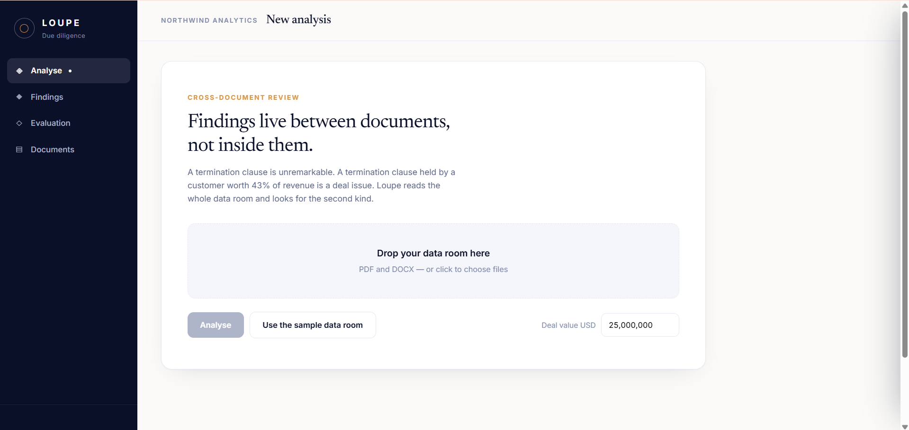
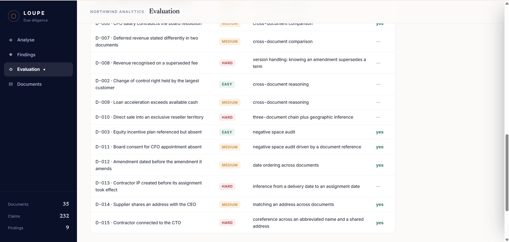
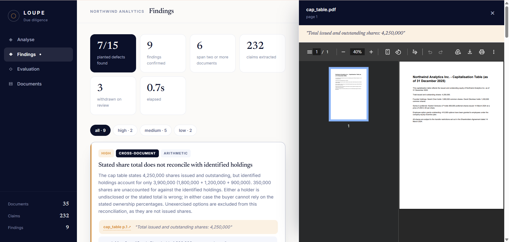
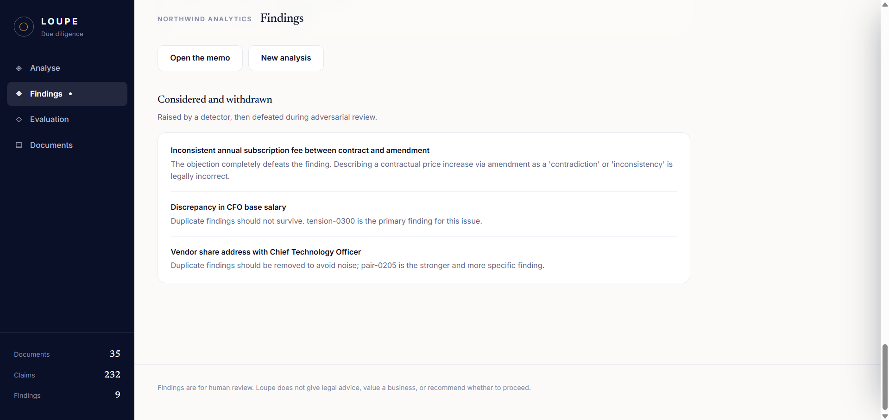
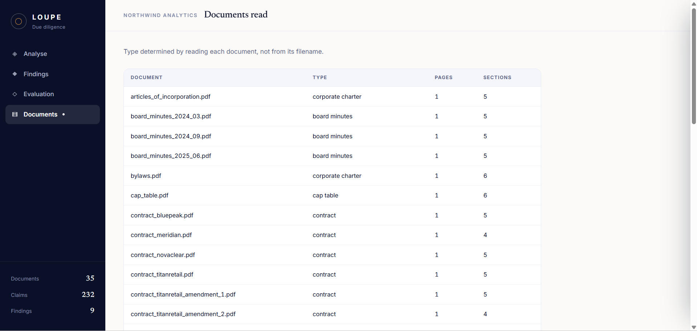

# Loupe

**A jeweller's loupe for the data room.**

A multi-agent system that reads an M&A data room, finds contradictions *between* documents, reports what the data room is missing, and cites every claim to an exact page and character span.

Built on the OpenAI Agents SDK, running on Google Gemini.



---

## Results

Measured against a synthetic corpus of 35 documents with 15 defects planted at known locations across six classes. Because the corpus is generated, ground truth is exact and recall is measured rather than asserted.

| | |
| --- | --- |
| **Recall** | 7 / 15 (47%) |
| **Findings matching nothing real** | 1 of 9 (11%) |
| **Claims extracted** | 232 |
| **Test suite** | 176 tests, all offline |

### By defect class

| Class | Found | Planted |
| --- | --- | --- |
| Missing document | 2 | 2 |
| Undisclosed relationship | 2 | 2 |
| Temporal impossibility | 1 | 2 |
| Arithmetic | 1 | 3 |
| Cross-document contradiction | 1 | 3 |
| Latent liability | 0 | 3 |

### By difficulty

| Difficulty | Found | Planted |
| --- | --- | --- |
| Easy | 2 | 3 |
| Medium | 4 | 8 |
| Hard | 1 | 4 |

Four defects were deliberately designed to exceed the current implementation — they need version handling, multi-document reasoning chains, or coreference resolution. **A benchmark that scores 100% on its first run is measuring the benchmark, not the system.**

```bash
python -m loupe.cli score
```

### Every planted defect names the capability it needs



*Each row records the capability its detection depends on, which makes the misses a prioritised engineering backlog rather than a shortfall.*

### A note on variance

Repeated runs over the same corpus and cache produced **6, 7, and 8** detections across one session. The variance traces to a single adversarial-review call landing differently — the critic sometimes retracts the change-of-control finding as standard commercial practice and sometimes does not.

The figures above are from one `score` run and are reproducible from the committed cache. A cold run may differ by one or two defects. This is reported rather than smoothed over, because a system whose output varies between identical runs is a fact about LLM pipelines worth stating.

---

## Ablation study

Removing one component at a time and re-scoring turns architectural claims into measurements.

| Configuration | Recall | Noise | vs baseline |
| --- | --- | --- | --- |
| Full system | 8/15 (53%) | 0/9 (0%) | baseline |
| No pair detector | 5/15 (33%) | 0/6 (0%) | **−3 defects** |
| No entity resolution | 7/15 (47%) | 0/8 (0%) | −1 defect |
| No tension detector | 8/15 (53%) | 0/9 (0%) | no change |
| No adversarial review | 10/15 (67%) | **7/18 (39%)** | +2 defects, +7 false positives |
| Deterministic only | 4/15 (27%) | 0/5 (0%) | −4 defects |

*(Baseline here is the ablation harness's own run, which detected 8. See the variance note above.)*

Three results worth stating plainly:

**The critic trades two defects for seven false positives.** Disabling adversarial review raises recall to 10/15 and raises the noise rate from 0% to 39%. That is the precision–recall tradeoff with a number attached rather than an opinion. For a diligence report, precision is the side that matters: an analyst who hits seven false findings stops reading, at which point effective recall is zero.

**The pair detector accounts for three of eight detections.** Deterministic rules choosing which claims to compare, then a model judging only those pairs, outperforms entity-grouped analysis alone.

**Four defects need no model at all.** The deterministic detectors — arithmetic reconciliation, date ordering, and the two gap audits — reach 4/15 on their own.

```bash
python -m loupe.cli ablate
```

---

## The problem

In an acquisition, the buyer gets a few weeks to inspect several hundred documents. The risks that matter are almost never inside one document — they emerge from the gap between two:

> **In the legal folder:** a customer contract lets the counterparty walk away if the supplier is acquired.
>
> **In the financial folder:** that same customer is 43% of revenue.

Neither document is alarming alone. The legal reviewer sees a routine clause. The financial reviewer sees customer concentration. Because reviewers are partitioned by domain, nobody holds both facts at once — and the buyer discovers the problem after closing.

Two further gaps in current practice:

- **Sampling.** Nobody reads all several hundred documents carefully. Large contracts get read; the rest get skimmed. Problems survive in the skimmed material.
- **Absence.** The most dangerous item is often the document that isn't there. An absent document leaves no artifact, so nothing represents it.

---

## The approach

Most designs for this problem assign one agent per document type: a legal agent, a financial agent, a compliance agent. That partition is the bug. It puts the cross-document contradiction in the space *between* agents, where nothing owns it.

Loupe inverts this. Agents are workers over a **shared evidence store**, not owners of a document category. An agent can reason about claims extracted from documents it never read.

```
Data room + diligence request list
              │
   Classifier → Extractor → Entity resolver
              │
      Claim graph + evidence store      ← the shared substrate
              │
   ┌──────────┼──────────┬─────────────┐
Arithmetic  Temporal   Gap audit   Candidate pairs
(no model) (no model)  (no model)   (no model)
   └──────────┴──────────┴──────┬──────┘
                                │
                        Pair adjudicator     ← judges only the pairs
                                │              a rule already flagged
                        Red team critic      ← tries to destroy each finding
                                │
                        Materiality scorer
                                │
                    Human approval (critical only)
                                │
                     Finding ledger → memo   ← memo is only a rendering
```

### Retrieval is mechanical; judgement is not

The single most consequential design decision, and it was reached by measurement rather than intuition.

The first implementation grouped claims by entity and asked a model to find conflicts within each group. It scored 3 of 15. Inspecting the failures showed why: **for most real contradictions the two halves belong to different entities.** A stated total is filed under the company; its components are filed under individual people or customers. A supplier's address is filed under the supplier; the founder's under the founder. Entity grouping cannot bring them together at all.

So deterministic Python rules decide **which** claims are worth comparing:

| Rule | Finds |
| --- | --- |
| Numeric mismatch | The same measure stated with different values |
| Total versus components | A stated total that does not equal the sum of its parts |
| Shared address | One address appearing in two documents for different parties |
| Trigger and magnitude | A right or condition beside an amount that makes it material |

The model then judges only those pairs, and each arrives with the reason it was selected. Recall improves because the question is narrow; cost falls because most claims are never sent.

Candidate generation is free and inspectable before any model call:

```bash
python -m loupe.cli pairs
```

### Three further mechanisms

**Provenance or abstain.** The model is never asked for character offsets — it returns the exact text it is quoting and the system locates that text itself. A fabricated quote resolves to nothing and the claim is discarded. Every citation is re-validated before it reaches the memo.



*Every finding cites a document and page. Clicking the citation opens that document beside the finding, with the quoted span shown above it. Verification costs one click rather than a search.*

**Adversarial review.** Findings move `proposed → challenged → confirmed | retracted`. The critic is not asked to review a finding; it is asked to construct the strongest case that the finding is wrong. `Finding.confirm()` raises on an unchallenged finding, so review cannot be skipped by accident.



*The report shows what was rejected and why, not only what was concluded.*

**Negative space, two ways.** A fixed diligence request list catches the documents any deal should have. A second detector reads the corpus for documents it *asserts exist* — "approved by written consent of the Board dated 9 September 2024" — and checks whether they are present. The second kind is a gap no checklist could anticipate, because the requirement came from the corpus itself.

---

## What adversarial review caught

The clearest evidence the critic works is that it caught an error in the system's own design.

The arithmetic detector originally summed founder holdings, preferred shares, **and employee options** against the stated cap table total. All tests passed. The planted defect was described in those terms.

The critic retracted the finding:

> *Adding unexercised employee options to issued and outstanding shares is a definitional error.*

It was right. "Issued and outstanding" excludes unexercised options; options are not issued shares until exercised. The detector, the corpus, and the test were all wrong in the same way, so the tests could never have caught it.

The corpus and detector were corrected. The real discrepancy is 350,000 shares stated as outstanding with no identified holder — a subtler and more realistic defect than the one originally planted.

---

## Agents

**Using a language model (6)**

| Agent | Role |
| --- | --- |
| Document Classifier | Identifies document type by reading the text, not the filename |
| Claim Extractor | Turns text into typed, cited claims. Parallel per document |
| Tension Detector | Compares claims about one entity across documents |
| Pair Adjudicator | Judges candidate pairs selected by deterministic rules |
| Red Team Critic | Attempts to destroy every proposed finding |
| Materiality Scorer | Estimates monetary impact relative to deal size |

**Deterministic (7)**

| Agent | Role |
| --- | --- |
| Entity Resolver | Merges name variants so claims about one company group together |
| Candidate Pair Generator | Selects which claims are worth comparing |
| Arithmetic Detector | Reconciles stated totals against components |
| Temporal Detector | Finds impossible date orderings |
| Gap Auditor | Reports expected documents that are absent |
| Reference Auditor | Reports documents the corpus asserts exist but does not contain |
| Memo Composer | Renders confirmed findings into a report |

Plus a **human approval gate** on critical findings, placed after adversarial review rather than before — a human asked to approve twenty unreviewed findings will rubber-stamp them; a human asked to approve two that survived a hostile critic is making a real decision.

Full detail in [`docs/02-multi-agent-design.md`](docs/02-multi-agent-design.md).

### Classification by reading, not by filename



*An earlier version inferred type from the filename. That works on a tidy corpus and fails on a real one — and it silently caused two schedules to be excluded from reconciliation, costing two detections until the cause was found.*

---

## Getting started

### Requirements

- Python 3.11 or newer
- A Gemini API key from [Google AI Studio](https://aistudio.google.com/apikey)

### Setup

```bash
git clone https://github.com/harnoorcodes/loupe.git
cd loupe

python -m venv .venv
source .venv/Scripts/activate    # Windows (Git Bash)
# source .venv/bin/activate      # macOS / Linux

pip install -r requirements.txt
pip install -e .

cp .env.example .env
# edit .env and add your key
```

### Verify

```bash
python -m loupe.cli check
```

### Run the pipeline

```bash
python scripts/generate_corpus.py    # 35 documents, 15 planted defects
python -m loupe.cli extract          # extract claims
python -m loupe.cli pairs            # inspect candidate pairs, no model calls
python -m loupe.cli detect --fresh   # detect, review, score materiality
python -m loupe.cli score            # measure against planted defects
python -m loupe.cli ablate           # measure component contribution
python -m loupe.cli memo             # write the findings memo
python -m loupe.web.app              # the web interface
```

### Tests

```bash
pytest
```

176 tests, all offline. No network calls, no API cost.

---

## Cost and reproducibility

A content-hashed disk cache sits in front of every model call. Prompt and model identity form the key, so an identical request returns the stored response without a network call.

- **Reproducibility.** A repeated run returns stored responses rather than re-sampling.
- **Speed.** A fully cached run of the whole pipeline completes in under a second.
- **Cost.** A cold run over 35 documents costs roughly 90 model calls, almost all of them extraction. Every run after that is free unless documents or prompts change.

This matters beyond convenience: a demonstration that depends on live API calls is one that can fail in front of an audience.

---

## Configuration

All configuration lives in `.env`. Nothing in the codebase reads environment variables directly — everything goes through a validated settings object, so a bad value fails at startup rather than silently at call time.

| Variable | Default | Purpose |
| --- | --- | --- |
| `GEMINI_API_KEY` | — | Required |
| `GEMINI_MODEL` | `gemini-3.5-flash` | Default model identifier |
| `GEMINI_TIER` | `free` | `free` or `paid`; gates real-document processing |
| `ALLOW_REAL_DOCUMENTS` | `false` | Must be `true` and tier `paid` to process real data |
| `MAX_DOCUMENTS_PER_RUN` | `250` | Denial-of-wallet ceiling |

### Why models are configuration, not code

During development, `gemini-2.5-flash` was found still listed in the provider's model catalogue while being closed to new users. Availability is not the same as visibility.

Agents therefore request a **role** — `extraction`, `reasoning`, or `critic` — and the mapping to a concrete model identifier lives in configuration. Model retirement is a one-line change. It also allows routing a cheap model to high-volume extraction and a capable one to cross-document reasoning.

---

## Running the Agents SDK without an OpenAI key

The SDK provides the orchestration framework; the model behind it is swappable. Four things need handling when the provider is Gemini, all in `src/loupe/llm/provider.py`:

1. **No Responses API.** Gemini does not implement it. Pin `OpenAIChatCompletionsModel` rather than relying on the SDK default, or every call returns 404.
2. **Tracing.** The default trace exporter uploads to OpenAI and returns 401 without an OpenAI key. Disable it or configure an alternative processor.
3. **Structured output.** Schema enforcement is less strict than OpenAI's, so a validate-repair-retry layer is required rather than optional.
4. **Rate limits.** Concurrency is capped and requests retry with exponential backoff and jitter.

---

## Security

| Threat | Mitigation |
| --- | --- |
| **Prompt injection via uploaded documents** | Document text is delimited and marked untrusted; extraction agents hold no tools and no handoff ability, so the most exposed agents have the least authority |
| **Data exposure to the provider** | A runtime guard refuses real documents on a free-tier key; enforced in code and covered by test |
| **Sensitive text in logs** | The logging layer redacts content-bearing fields; logs carry document identifiers and span coordinates only |
| **Denial of wallet** | Document count and token ceilings |
| **Ledger tampering** | Append-only ledger; corrections are versioned entries, not in-place edits |

Prompt injection is a live threat here rather than a theoretical one — the party who assembled the data room has a direct financial interest in incomplete review, and controls the input the system reads. **The injection defence is designed but not yet verified by test.**

---

## Limitations

**Eight of fifteen defects are not detected.** The per-defect table names the capability each one needs. Four require version handling, multi-document chains, or inference the system does not perform. Four more are within reach of better component selection or prompt work.

**No version handling.** An amendment that supersedes a term is treated as contradicting it. This is why the critic retracts the superseded-fee finding, and it would produce false positives on any real data room, which are full of amendments.

**The critic is over-aggressive.** The ablation quantifies the cost at two defects.

**Output varies between runs.** Six, seven, and eight detections were observed on identical input across one session.

**The source viewer embeds PDFs only.** Clicking a citation opens the document at the cited page for PDFs. DOCX files download instead, because browsers cannot render Word documents inline. Verification of a DOCX citation therefore costs a download rather than a click.

**Entity resolution handles suffix variants only.** Coreference such as "the Company" is unresolved and appears in the claim graph as its own entity.

**The loan principal was never extracted as a numeric claim.** The extractor captured the repayment date sentence instead of the facility amount, so no detector can compare it against available cash.

**The corpus is synthetic and single-archetype.** Thirty-five documents demonstrates the mechanism. It does not characterise performance on a real data room, which is larger, messier, and includes scanned documents this system flags as unreadable rather than processing.

---

## Scope

**In scope:** single-deal analysis, B2B SaaS acquisitions in the USD 5–50M range, PDF and DOCX, four workstreams (financial, legal, corporate, compliance).

**Out of scope:** OCR, live integrations, multi-deal portfolios, non-English corpora, deals above USD 50M where the diligence process differs structurally.

Loupe does not decide whether to proceed with a transaction, provide legal advice, or produce a valuation. It surfaces findings with evidence; a qualified human decides.

---

## Documentation

- [`docs/01-problem-analysis.md`](docs/01-problem-analysis.md) — business context, stakeholders, requirements, personas, threat model
- [`docs/02-multi-agent-design.md`](docs/02-multi-agent-design.md) — agent architecture, roles, handoff flow, tool integration
- [`docs/03-evaluation.md`](docs/03-evaluation.md) — benchmark design, results, ablation study

---
## Demo

An 11-minute walkthrough: [https://drive.google.com/file/d/1LlttpwjFEfdlbCERQDqXq3f-8IbBkJB_/view?usp=drive_link]

## Licence

MIT
