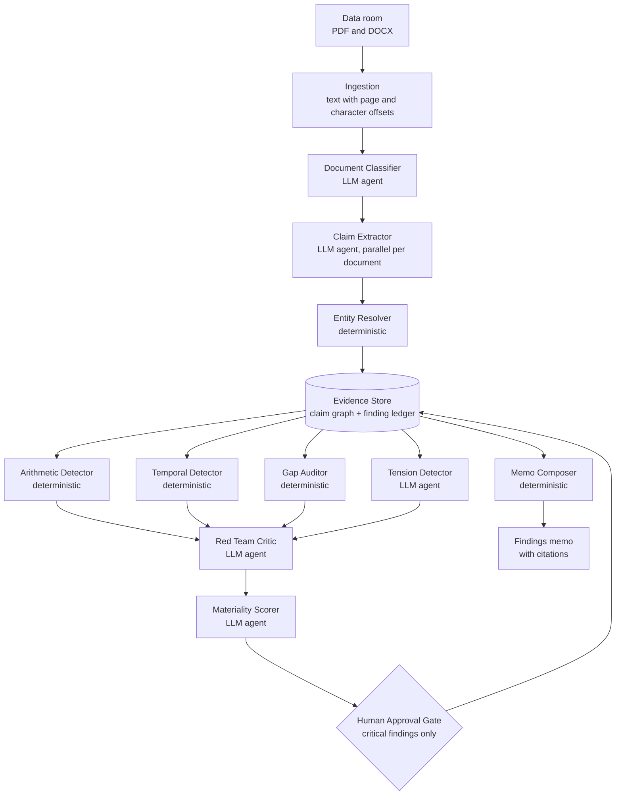
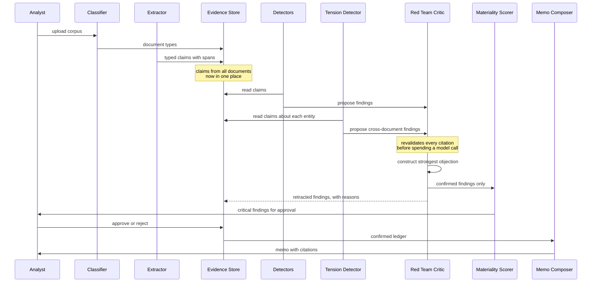
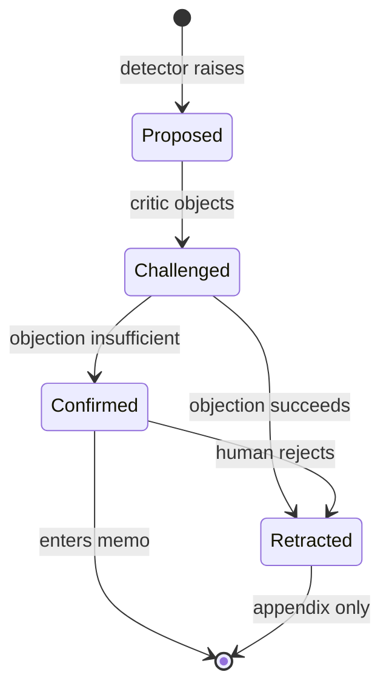

# Multi-Agent Design

**Project:** Loupe — a multi-agent due diligence system for M&A data rooms
**Capstone:** Summer School '26, OpenAI Agents SDK

---

## 1. Design principle

Most multi-agent designs for document review assign one agent per document type: a legal agent, a financial agent, a compliance agent. That partition is the central mistake this system was built to avoid.

The findings that matter in due diligence live *between* documents. A change-of-control clause is unremarkable in isolation. A customer representing 43% of revenue is unremarkable in isolation. Only together do they mean that an acquisition destroys half the target's income. Under a document-type partition, the legal agent sees one half, the financial agent sees the other, and no agent owns the space between them.

Loupe therefore organises agents by **cognitive function over a shared substrate**, not by document ownership. Every agent reads from and writes to a common evidence store. An agent can reason about claims extracted from documents it never read.

A second principle governs which agents exist at all:

> **Use a language model only where judgement is required.**

Reconciling a share total is arithmetic, not judgement. Checking whether a file exists is a fact, not an opinion. Comparing two dates is deterministic. These are implemented in Python: faster, free, and correct every time. The model is reserved for extraction, classification, contradiction detection, adversarial review, and materiality — five tasks that genuinely require language understanding.

---

## 2. Architecture

The evidence store sits at the centre deliberately. Agents do not message each other in prose; they read and write typed objects in a shared structure. That is what makes cross-document reasoning possible rather than merely aspirational.

---

## 3. Agent roles

### 3.1 LLM agents

| Agent | Model role | Mission |
| --- | --- | --- |
| Document Classifier | extraction (cheap) | Identify what kind of document each file is, by reading it |
| Claim Extractor | extraction (cheap) | Turn document text into typed, cited claims |
| Tension Detector | reasoning | Find contradictions between claims from different documents |
| Red Team Critic | critic | Attempt to destroy every proposed finding |
| Materiality Scorer | reasoning | Estimate monetary impact relative to deal size |

### 3.2 Deterministic agents

| Agent | Mission |
| --- | --- |
| Entity Resolver | Merge name variants so claims about one company group together |
| Arithmetic Detector | Reconcile stated totals against their components |
| Temporal Detector | Find events dated impossibly relative to each other |
| Gap Auditor | Report expected documents that are absent |
| Memo Composer | Render confirmed findings into a report |

### 3.3 Human in the loop

| Component | Mission |
| --- | --- |
| Approval Gate | Require explicit human sign-off on critical findings before reporting |

---

## 4. Agent detail

### Document Classifier

**Input:** the opening 400 characters of each readable document.
**Output:** a document type per file, with a stated reason.
**Model:** cheap extraction model. Classification is mechanical judgement.

Before this agent, document type was inferred from the filename. That works on a tidy corpus and fails on a real one, where files carry client reference numbers or names like `Doc1_final_v3_SIGNED.pdf`. Reading the opening text is more robust, because a document announces what it is in its first paragraph.

All documents are classified in one call, so cost is one request per corpus rather than one per file. The filename heuristic remains as a fallback if the model is unavailable, so classification degrades rather than failing.

*Observed behaviour:* correctly reclassified `ip_assignment.docx` from `other` to `contract`, which the filename heuristic had missed.

### Claim Extractor

**Input:** document blocks, batched six at a time.
**Output:** typed claims, each bound to an exact source span.
**Model:** cheap extraction model, run in parallel across documents.

The critical design decision in this agent concerns provenance.

> **The model is never asked for character offsets. It returns the exact text it is quoting, and the system locates that text itself.**

A model asked for offsets will confidently return plausible wrong numbers, producing citations that look correct and point at nothing. By requiring a verbatim quote and locating it with a string search, a fabricated quote resolves to nothing and the claim is discarded rather than emitted with a broken citation.

Claims are atomic. "The company has 4,250,000 shares and 12 employees" is two claims, not one. Atomicity is what makes cross-document comparison mechanical rather than interpretive.

### Entity Resolver

**Input:** raw subject strings from extracted claims.
**Output:** a canonical key per entity.

Extraction produces variants of the same name: "TitanRetail Group Limited" and "TitanRetail Group", "Northwind Analytics Inc." and "Northwind Analytics". The Tension Detector groups claims by subject, so unmerged variants mean contradictions between them are never compared — the precise failure the system exists to prevent.

This is deliberately not a full entity resolver. It is suffix stripping and case folding: no model call, no cost, deterministic. It resolves the variants that actually occur. Coreference — "the Company", "the Supplier" — is a harder problem left to a later version.

*Observed behaviour:* merging the TitanRetail variants was what made the flagship cross-document finding reachable. Before normalisation the contract claims and the revenue claims sat under different keys and were never compared.

### Arithmetic Detector

**Input:** quantity claims about shares and equity.
**Output:** reconciliation findings.
**No model.**

Sums stated totals against their components and reports mismatches. Three hazards are handled explicitly:

1. **Duplicate claims.** The same founder holding appears in both the cap table and their employment agreement. Naive summing double-counts it. Claims are deduplicated by value, preferring the cap table as authoritative.
2. **Total versus component ambiguity.** An option pool described as "outstanding" contains a total-marker word but is a component. Only the largest stated total is reconciled against.
3. **Defined terms.** "Issued and outstanding" excludes unexercised options; "fully diluted" includes them. Adding options to an issued count is a definitional error, not a discrepancy.

The third hazard was discovered by the Red Team Critic, not by a test. See section 8.

### Temporal Detector

**Input:** claims containing parseable dates.
**Output:** ordering-impossibility findings.
**No model.**

Reports events dated before the company's incorporation, since nothing a company does can predate its own existence.

### Gap Auditor

**Input:** the corpus and a diligence request list of 14 expected documents.
**Output:** missing-document findings.
**No model.**

This agent reports what is *absent*, which retrieval systems structurally cannot do. It rests on one distinction:

> **A document being present is not the same as a document being mentioned.**

The cap table states that options were granted "under the company equity incentive plan". No such plan exists in the corpus. Searching document body text for keywords would treat that mention as proof of presence and hide the exact defect the audit is for. Presence is therefore matched against filenames only; body text is used for a different purpose — deciding whether an item applies at all.

That conditional logic is what makes the finding meaningful. An equity incentive plan is reported missing *because the corpus shows options were granted*, not because a generic checklist listed one.

### Tension Detector

**Input:** all claims about one entity, drawn from multiple documents.
**Output:** cross-document conflict findings.
**Model:** reasoning model, one call per entity, run concurrently.

The prompt design is the most important decision in the system:

> **The agent is asked "what conflicts here?" — never "find risks."**

A model asked to find risks will find them, because that is what it was asked to do. It will produce fluent, plausible, unfalsifiable risks. Asked instead what conflicts between specific claims it can see, it must either point at two of them or return nothing. The second question has a wrong answer; the first does not.

Every reported conflict must cite two claim IDs from the list supplied. A conflict citing an ID that was never given is discarded — the tension detector's equivalent of span validation.

Entities appearing in only one document are skipped. A conflict inside one document is usually a drafting artifact; a conflict across documents is usually a real finding.

*Observed behaviour:* on a run over six entities, five returned zero conflicts and one returned the genuine finding. The agent is not manufacturing conflicts to appear useful.

### Red Team Critic

**Input:** every proposed finding, with evidence.
**Output:** confirm or retract, with the objection recorded.
**Model:** critic model, all findings reviewed in a single call.

The critic is not asked to review a finding. It is asked to **destroy** it.

That distinction is the mechanism. A reviewer asked "is this correct?" agrees, because agreement is the path of least resistance for a language model. A reviewer instructed to construct the strongest case against a finding surfaces the rounding artifact, the superseded amendment, the definitional error — and when it cannot, the finding has earned its place.

Reviewing all findings in one call also gives the critic something it otherwise lacks: sight of the other findings, so it can detect that two findings describe the same issue.

Before any model call, every citation is re-validated against its source document. A finding whose evidence does not resolve is retracted automatically and never consumes a model call.

*Observed behaviour:* on the reference corpus the critic retracted two of eight findings, revised the severity of two more, and confirmed the rest over its own objections.

### Materiality Scorer

**Input:** confirmed findings and the transaction value.
**Output:** an estimated monetary impact and a revised severity.
**Model:** reasoning model, one call for all findings.

Severity labels are weak decision inputs. "High" tells a buyer to worry; a dollar figure tells them how much, and whether it justifies renegotiating the price.

The agent may use only figures that appear in the finding's own evidence. It is instructed to report `quantifiable: false` when it cannot ground an estimate, because an invented figure in a diligence memo is worse than no figure at all.

*Observed behaviour:* quantified the share discrepancy at approximately USD 2.06M with a stated basis, and correctly declined to quantify four missing-document findings.

### Approval Gate

**Input:** confirmed findings.
**Output:** findings with a human decision recorded.

Critical-severity findings require explicit sign-off before entering the memo.

The gate is deliberately placed *after* adversarial review rather than before. A human asked to approve twenty unreviewed findings will rubber-stamp them. A human asked to approve two findings that already survived a hostile critic is making a real decision, with their attention where it matters. The critic's objection is displayed alongside the finding, so the reviewer sees what was argued against it rather than only the conclusion.

### Memo Composer

**Input:** the confirmed finding ledger.
**Output:** a markdown memo with citations.
**No model.**

The memo is a *rendering* of the ledger, never a separate act of writing. It cannot introduce a claim that is not already in the ledger. Because no model is called, the memo cannot hallucinate, cannot vary between runs, and costs nothing.

---

## 5. Interaction and handoff flow

### Handoff conditions

| From | To | Condition |
| --- | --- | --- |
| Classifier | Extractor | Document is readable |
| Extractor | Evidence Store | Quote resolves to real source text |
| Any detector | Red Team Critic | A finding is proposed |
| Red Team Critic | Materiality Scorer | Finding survived the objection |
| Red Team Critic | Ledger (retracted) | Objection defeated the finding, or citation failed validation |
| Materiality Scorer | Approval Gate | Severity is critical |
| Ledger | Memo Composer | Status is confirmed |

The lifecycle is enforced by the type system rather than by convention. `Finding.confirm()` raises an exception unless the finding was challenged first, so no code path can admit an unreviewed finding to the memo.

---

## 6. Tool and integration overview

| Integration | Used by | Purpose |
| --- | --- | --- |
| PDF text extraction (`pypdf`) | Ingestion | Text with page boundaries preserved |
| DOCX text extraction (`python-docx`) | Ingestion | Paragraph and table text |
| Gemini API via OpenAI-compatible endpoint | All LLM agents | Model inference |
| Span validator | Extractor, Critic | Verify a citation against source text |
| Claim retrieval by entity | Tension Detector | Cross-document claim lookup |
| Entity normaliser | Evidence Store | Merge name variants |
| Diligence request list | Gap Auditor | Expected-document checklist |
| Evidence store persistence | All agents | JSON claim graph and append-only ledger |
| Response cache | All LLM agents | Content-hashed disk cache |

### Notes on the model integration

The OpenAI Agents SDK supplies the orchestration framework; the model behind it is swappable. Four provider-specific issues are handled in `src/loupe/llm/provider.py`:

1. **No Responses API.** Gemini does not implement it, so `OpenAIChatCompletionsModel` is pinned rather than relying on the SDK default.
2. **Tracing.** The SDK's default trace exporter uploads to OpenAI and fails without an OpenAI key. It is disabled.
3. **Structured output.** Schema enforcement is less strict than OpenAI's, so a validate-repair-retry layer is mandatory rather than optional.
4. **Rate limits.** Concurrency is capped and requests retry with exponential backoff and jitter.

Agents request a **model role** — `extraction`, `reasoning`, or `critic` — and the mapping to a concrete model identifier lives in configuration. During development, `gemini-2.5-flash` was found still listed in the provider's model catalogue while being closed to new users. Availability is not the same as visibility. Making model identifiers configuration rather than code meant that discovery cost one line rather than a refactor.

---

## 7. Memory and context management

| Layer | Contents | Lifetime |
| --- | --- | --- |
| Document store | Parsed text and blocks with span coordinates | Per run |
| Claim graph | Typed claims indexed by document and by entity | Persisted |
| Finding ledger | Append-only, versioned findings | Persisted |
| Progress record | Which documents have been extracted | Persisted |
| Response cache | Model responses keyed by content hash | Persisted |

Two properties matter.

**The ledger is append-only.** A lifecycle transition writes a new entry rather than editing the old one, so the audit trail records what was proposed, what was objected to, and what was decided. `current_findings()` returns the latest version of each finding, so history is retained without polluting output.

**Extraction is checkpointed.** Documents already processed are skipped on a re-run, so an interrupted run resumes rather than repeating work. This was exercised in practice: a run interrupted by a rate limit resumed and extracted only the remaining documents.

---

## 8. What adversarial review actually caught

The clearest evidence that the critic mechanism works is that it caught an error in the system's own design.

The arithmetic detector originally reconciled a cap table by summing founder holdings, preferred shares, **and employee options** against the stated total. All tests passed. The planted defect was described in terms of that sum.

The critic retracted the finding with this objection:

> *Adding unexercised employee options to issued and outstanding shares is a definitional error.*

It is correct. "Issued and outstanding" is a term of art that excludes unexercised options; options are not issued shares until exercised. The detector, the corpus, and the test were all wrong in the same way, and three days of passing tests had not surfaced it.

The corpus and detector were corrected. The real discrepancy is 350,000 shares stated as outstanding with no identified holder — a subtler and more realistic defect than the one originally planted.

---

## 9. Results

Measured against a synthetic corpus with defects planted at known locations.

| Defect | Class | Detected |
| --- | --- | --- |
| D-001 | Arithmetic: unreconciled share total | Yes |
| D-002 | Cross-document latent liability | Yes |
| D-003 | Missing document | Yes |

**Recall: 3/3. Findings corresponding to nothing real: 0 of 6.**

Three further findings report documents genuinely absent from the corpus but never planted — a shareholders agreement, a receivables schedule, and tax returns. Reporting them is correct behaviour, so they are counted separately rather than as errors.

A ten-document corpus makes gap detection easy, so the low noise rate is not a strong claim on its own. Recall on the cross-document defect is the meaningful result: it required evidence from two documents that no single reader would have compared.

---

## 10. Limitations

- **Evidence spans can be narrower than the clause they describe.** The change-of-control finding cites the notice period rather than the full clause. The critic noticed this and objected on those grounds.
- **Entity resolution handles suffix variants only.** Coreference such as "the Company" is unresolved.
- **The corpus is small.** Ten documents is enough to demonstrate the mechanism, not enough to characterise performance.
- **Materiality is conservative.** The scorer declines to quantify more often than it strictly needs to. This is the correct failure direction but leaves value on the table.
- **Single deal archetype.** Tuned for a B2B SaaS acquisition in the USD 5–50M range.
