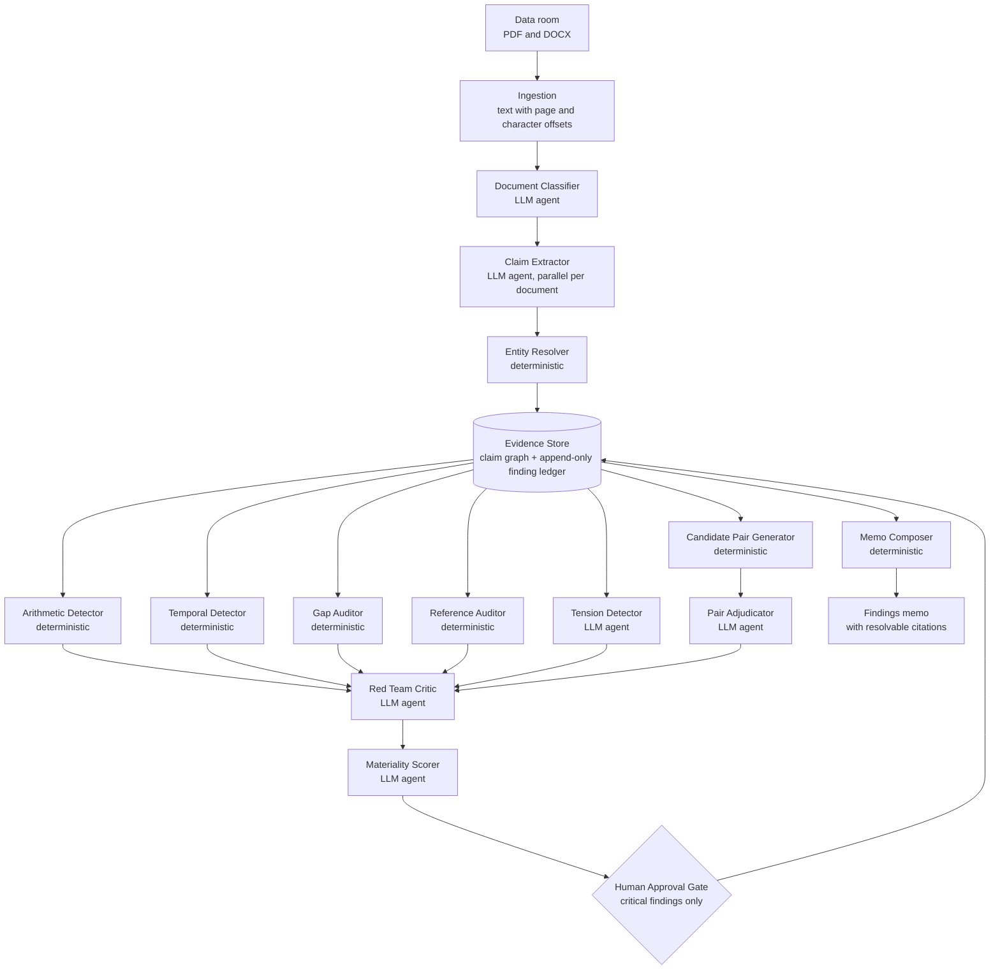
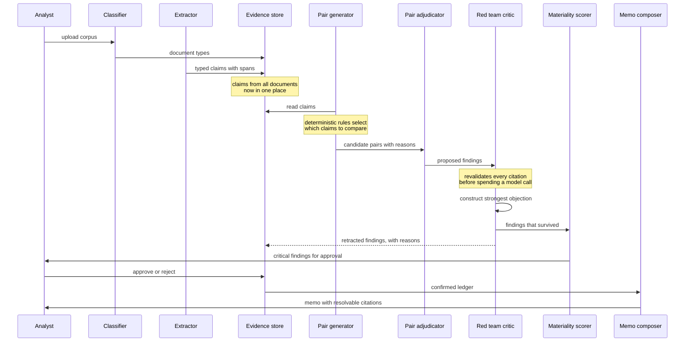
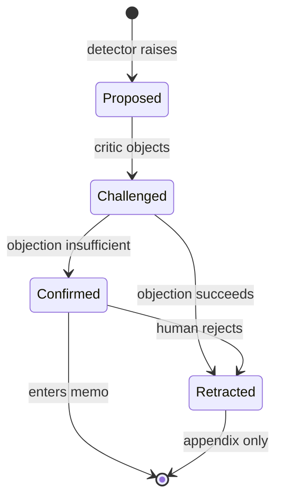

# Multi-Agent Design

**Project:** Loupe — a multi-agent due diligence system for M&A data rooms
**Capstone:** Summer School '26, OpenAI Agents SDK

---

## 1. Design principles

### 1.1 Agents are workers over a substrate, not owners of documents

Most multi-agent designs for document review assign one agent per document type: a legal agent, a financial agent, a compliance agent. That partition is the central mistake this system was built to avoid.

The findings that matter in due diligence live *between* documents. A change-of-control clause is unremarkable in isolation. A customer representing 43% of revenue is unremarkable in isolation. Only together do they mean an acquisition destroys half the target's income. Under a document-type partition, the legal agent sees one half, the financial agent the other, and no agent owns the space between them.

Loupe organises agents by **cognitive function over a shared evidence store**. Every agent reads from and writes to a common structure of typed claims. An agent can reason about claims extracted from documents it never read.

### 1.2 Retrieval is mechanical; judgement is not

The most consequential decision in the system, and it was reached by measurement rather than design.

The first implementation grouped claims by entity and asked a model to find conflicting pairs within each group. On a 35-document corpus this scored 3 of 15. Examining the failures showed why: for most real contradictions, **the two halves belong to different entities**. A stated total is filed under the company; its components are filed under individual people or customers. A supplier's address is filed under the supplier; the founder's address under the founder. Entity grouping cannot bring them together.

The system now separates the two concerns:

- **Which claims are worth comparing** is decided by deterministic Python rules. Exhaustive, free, inspectable.
- **Whether a compared pair is a finding** is decided by a model, one narrow question at a time.

The ablation study isolates this contribution at three defects.

### 1.3 Use a model only where judgement is required

Reconciling a share total is arithmetic. Checking whether a file exists is a fact. Comparing two dates is deterministic. These run in Python: faster, free, correct every time.

Six components use a language model. Seven do not. The deterministic detectors alone reach 4 of 15 defects, which is the floor the model has to beat — and it does, reaching 8.

---

## 2. Architecture



The evidence store sits at the centre deliberately. Agents do not message each other in prose; they read and write typed objects in a shared structure. That is what makes cross-document reasoning possible rather than merely aspirational.

---

## 3. Agent roles

### 3.1 Agents using a language model

| Agent | Model role | Mission |
| --- | --- | --- |
| Document Classifier | extraction | Identify what kind of document each file is, by reading it |
| Claim Extractor | extraction | Turn document text into typed, cited claims |
| Tension Detector | reasoning | Compare claims about one entity across documents |
| Pair Adjudicator | reasoning | Judge candidate pairs selected by deterministic rules |
| Red Team Critic | critic | Attempt to destroy every proposed finding |
| Materiality Scorer | reasoning | Estimate monetary impact relative to deal size |

### 3.2 Deterministic agents

| Agent | Mission |
| --- | --- |
| Entity Resolver | Merge name variants so claims about one company group together |
| Candidate Pair Generator | Decide which claims are worth comparing |
| Arithmetic Detector | Reconcile stated totals against their components |
| Temporal Detector | Find events dated impossibly relative to each other |
| Gap Auditor | Report expected documents that are absent |
| Reference Auditor | Report documents the corpus asserts exist but does not contain |
| Memo Composer | Render confirmed findings into a report |

### 3.3 Human in the loop

| Component | Mission |
| --- | --- |
| Approval Gate | Require explicit human sign-off on critical findings before reporting |

---

## 4. Agent detail

### Document Classifier

**Input:** the opening 400 characters of each readable document, batched twelve at a time.
**Output:** a document type per file, with a stated reason.
**Model:** cheap extraction model.

Before this agent, document type was inferred from the filename. That works on a tidy corpus and fails on a real one, where files carry client reference numbers or names like `Doc1_final_v3_SIGNED.pdf`. Reading the opening text is more robust, because a document announces what it is in its first paragraph.

Two failures in this component cost detections and are worth recording:

**Batching.** An earlier version processed only the first twenty documents and silently fell back to the filename heuristic for the rest. Batches now cover the whole corpus and run concurrently.

**The fallback path.** The `pairs` command runs without the classifier, so document type comes from the filename heuristic — and that heuristic had no hint matching `option_grant_schedule` or `revenue_by_customer`. Both were typed `other`, and a downstream filter silently excluded every claim they contained. Two detections were lost to a gap in a fallback nobody had exercised.

*Observed behaviour:* reclassifies documents on the reference corpus, including `ip_assignment.docx` from `other` to `contract`.

### Claim Extractor

**Input:** document blocks, batched six at a time.
**Output:** typed claims, each bound to an exact source span.
**Model:** cheap extraction model, parallel across documents.

The critical design decision concerns provenance.

> **The model is never asked for character offsets. It returns the exact text it is quoting, and the system locates that text itself.**

A model asked for offsets will confidently return plausible wrong numbers, producing citations that look correct and point at nothing. By requiring a verbatim quote and locating it with a string search, a fabricated quote resolves to nothing and the claim is discarded rather than emitted with a broken citation.

Claims are atomic. "The company has 4,250,000 shares and 12 employees" is two claims, not one. Atomicity is what makes cross-document comparison mechanical rather than interpretive.

*Observed behaviour:* 232 claims from 35 documents. One known miss: the loan agreement's principal amount was captured as part of a repayment-date sentence rather than as a numeric claim, which makes one planted defect unreachable by any detector.

### Entity Resolver

**Input:** raw subject strings from extracted claims.
**Output:** a canonical key per entity.

Extraction produces variants of the same name: "TitanRetail Group Limited" and "TitanRetail Group", "Northwind Analytics Inc." and "Northwind Analytics". Grouping and pairing both depend on subject identity, so unmerged variants mean the claims are never compared.

Deliberately not a full resolver: suffix stripping and case folding, no model call, deterministic. Coreference — "the Company", "the Executive" — is unresolved and appears in the claim graph as its own entity.

*Measured contribution:* removing it costs one defect.

### Candidate Pair Generator

**Input:** the whole claim graph.
**Output:** pairs of claims a rule considers worth comparing.
**No model.**

Four rules, each targeting a class of contradiction entity grouping cannot reach:

| Rule | Selects | Guards against |
| --- | --- | --- |
| **Numeric mismatch** | Two claims stating the same measure with different values | Generic measures across unrelated subjects; different reporting periods; authorised capital compared to issued |
| **Total versus components** | A stated total and the parts that should sum to it | Components from the same document as the total; components from a document of the wrong kind; proportions treated as amounts; off-period figures |
| **Shared address** | One street address appearing in two documents for different parties | Same-entity pairs |
| **Trigger and magnitude** | A right or condition beside an amount concerning the same party | Routine notice periods filed under the company, which would otherwise pair with every figure in the corpus |

The guards are not incidental. A first implementation produced 49 candidate pairs, most of them noise: two founders' shareholdings compared against each other, FY2024 revenue against FY2025, a sixty-day notice period paired with all nine financial figures. Successive fixes reduced this to 26 pairs with no loss of defect coverage.

Because generation is deterministic and free, candidates can be inspected before any model call:

```bash
python -m loupe.cli pairs
```

*Measured contribution:* three defects.

### Pair Adjudicator

**Input:** candidate pairs, batched six per call, each with the reason it was selected.
**Output:** a verdict per pair.
**Model:** reasoning model.

Retrieval was mechanical; this is the judgement. Because each pair arrives with its selection reason, the model answers a narrow question about two specific claims rather than searching a list of thirty for something interesting.

The prompt is explicit that most pairs will be innocent and saying so is correct, and that a false finding costs more than a missed one because an analyst who stops trusting the report stops reading it.

### Tension Detector

**Input:** all claims about one entity, drawn from multiple documents.
**Output:** cross-document conflict findings.
**Model:** reasoning model.

The prompt design decision:

> **The agent is asked "what conflicts here?" — never "find risks."**

A model asked to find risks will find them. It will produce fluent, plausible, unfalsifiable risks. Asked instead what conflicts between specific claims it can see, it must either point at two of them or return nothing.

Every reported conflict must cite two claim IDs from the list supplied. A conflict citing an ID that was never given is discarded — the equivalent of span validation.

*Measured contribution: none.* The ablation shows removing this agent changes no result. It finds only what the pair generator already finds. It is retained because it is the more general mechanism and would catch conflict shapes no rule anticipates, but the honest reading is that on this corpus it earns no cost.

### Arithmetic Detector

**Input:** quantity claims about shares and equity.
**Output:** reconciliation findings.
**No model.**

Three hazards handled explicitly:

1. **Duplicate claims.** The same founder holding appears in the cap table and in their employment agreement. Naive summing double-counts. Claims are deduplicated by value, preferring the cap table as authoritative.
2. **Total versus component ambiguity.** An option pool described as "outstanding" carries a total marker but is a component. Only the largest stated total is reconciled against.
3. **Defined terms.** "Issued and outstanding" excludes unexercised options; "fully diluted" includes them. Conflating the two is a definitional error, not a discrepancy. See section 8.

### Temporal Detector

**Input:** claims and documents containing parseable dates.
**Output:** ordering-impossibility findings.
**No model.**

Two checks: events dated before the company's incorporation, and an amendment dated before the amendment it claims to modify.

The amendment check operates on documents rather than claims, deliberately. The amendment number and execution date sit in the opening paragraph, and whether the extractor happened to emit both as claims is not something this check should depend on.

*Observed behaviour:* detects that Amendment No. 2, dated 3 November 2024, states it follows Amendment No. 1, dated 12 January 2025.

### Gap Auditor

**Input:** the corpus and a diligence request list of 14 expected documents.
**Output:** missing-document findings.
**No model.**

Reports what is *absent*, which retrieval systems structurally cannot do. It rests on one distinction:

> **A document being present is not the same as a document being mentioned.**

The cap table states options were granted "under the company equity incentive plan". No such plan exists in the corpus. Searching document body text for keywords would treat that mention as proof of presence and hide the exact defect the audit is for. Presence is matched against filenames only; body text is used for a different purpose — deciding whether an item applies at all.

An equity incentive plan is reported missing *because the corpus shows options were granted*, not because a generic checklist listed one.

### Reference Auditor

**Input:** document text, scanned for references to other documents by name and date.
**Output:** missing-document findings for documents the corpus asserts exist.
**No model.**

The gap auditor knows what any deal should have. This one knows what *this* deal claims to have.

When a document says "as approved by written consent of the Board of Directors dated 9 September 2024", it is asserting that a discrete executed instrument exists. If no such document is in the room, that is a gap no fixed checklist could anticipate, because the requirement came from the corpus itself.

The date matters. A generic cross-reference — "as set out in the shareholders agreement" — may point at something never intended to be a separate document. A reference carrying a specific execution date is asserting a signed instrument on a particular day.

Matching is by token overlap against filenames rather than exact string equality, because a corpus names a file `board_minutes_2024_09` for something a contract calls "written consent of the Board of Directors". Requiring exact matches would report every reference as missing; requiring none would report none.

*Observed behaviour:* finds two references in the reference corpus. Correctly resolves the shareholders agreement as present, and correctly reports the board consent as absent.

### Red Team Critic

**Input:** every proposed finding, with evidence, reviewed in a single call.
**Output:** confirm or retract, with the objection recorded.
**Model:** critic model.

The critic is not asked to review a finding. It is asked to **destroy** it.

A reviewer asked "is this correct?" agrees, because agreement is the path of least resistance for a language model. A reviewer instructed to construct the strongest case against a finding surfaces the rounding artifact, the superseded amendment, the definitional error — and when it cannot, the finding has earned its place.

Reviewing all findings in one call also gives the critic sight of the others, so it can detect that two findings describe the same issue. On the reference corpus it retracts several as duplicates.

Before any model call, every citation is re-validated against its source document. A finding whose evidence does not resolve is retracted automatically and never consumes a model call.

*Measured contribution:* the critic costs two defects and removes seven false positives. Disabling it raises recall from 8/15 to 10/15 and the noise rate from 0% to 39%.

### Materiality Scorer

**Input:** confirmed findings and the transaction value.
**Output:** an estimated monetary impact and a revised severity.
**Model:** reasoning model.

Severity labels are weak decision inputs. "High" tells a buyer to worry; a dollar figure tells them how much, and whether it justifies renegotiating the price.

The agent may use only figures appearing in the finding's own evidence, and is instructed to report `quantifiable: false` when it cannot ground an estimate. An invented figure in a diligence memo is worse than no figure.

### Approval Gate

**Input:** confirmed findings.
**Output:** findings with a human decision recorded.

Critical-severity findings require explicit sign-off before entering the memo.

Placed *after* adversarial review, deliberately. A human asked to approve twenty unreviewed findings will rubber-stamp them. A human asked to approve two that already survived a hostile critic is making a real decision. The critic's objection is displayed alongside the finding, so the reviewer sees what was argued rather than only the conclusion.

### Memo Composer

**Input:** the confirmed finding ledger.
**Output:** a markdown memo with citations.
**No model.**

The memo is a *rendering* of the ledger, never a separate act of writing. It cannot introduce a claim not already in the ledger. Because no model is called, the memo cannot hallucinate, cannot vary between runs, and costs nothing.

---

## 5. Interaction and handoff flow



### Handoff conditions

| From | To | Condition |
| --- | --- | --- |
| Classifier | Extractor | Document is readable |
| Extractor | Evidence store | Quote resolves to real source text |
| Pair generator | Pair adjudicator | A rule selected the pair |
| Any detector | Red team critic | A finding is proposed |
| Red team critic | Materiality scorer | Finding survived the objection |
| Red team critic | Ledger (retracted) | Objection succeeded, or citation failed validation |
| Materiality scorer | Approval gate | Severity is critical |
| Ledger | Memo composer | Status is confirmed |

The lifecycle is enforced by the type system rather than by convention. `Finding.confirm()` raises unless the finding was challenged first, so no code path can admit an unreviewed finding to the memo.



---

## 6. Tool and integration overview

| Integration | Used by | Purpose |
| --- | --- | --- |
| PDF text extraction (`pypdf`) | Ingestion | Text with page boundaries preserved |
| DOCX text extraction (`python-docx`) | Ingestion | Paragraph and table text |
| Gemini API via OpenAI-compatible endpoint | All LLM agents | Model inference |
| Span validator | Extractor, Critic | Verify a citation against source text |
| Claim retrieval by entity | Tension detector | Cross-document claim lookup |
| Entity normaliser | Evidence store, pair generator | Merge name variants |
| Candidate pair rules | Pair generator | Select claims worth comparing |
| Diligence request list | Gap auditor | Expected-document checklist |
| Reference patterns | Reference auditor | Documents the corpus asserts exist |
| Evidence store persistence | All agents | JSON claim graph and append-only ledger |
| Response cache | All LLM agents | Content-hashed disk cache |
| Ablation harness | Evaluation | Component contribution measurement |
| FastAPI web interface | Analyst | Upload, progress, findings, source viewer |

### Notes on the model integration

The OpenAI Agents SDK supplies the orchestration framework; the model behind it is swappable. Four provider-specific issues are handled in `src/loupe/llm/provider.py`:

1. **No Responses API.** Gemini does not implement it, so `OpenAIChatCompletionsModel` is pinned rather than relying on the SDK default.
2. **Tracing.** The SDK's default trace exporter uploads to OpenAI and fails without an OpenAI key. It is disabled.
3. **Structured output.** Schema enforcement is less strict than OpenAI's, so a validate-repair-retry layer is mandatory rather than optional.
4. **Rate limits.** Concurrency is capped and requests retry with exponential backoff and jitter.

Agents request a **model role** — `extraction`, `reasoning`, or `critic` — and the mapping to a concrete identifier lives in configuration. During development, `gemini-2.5-flash` was found still listed in the provider's catalogue while closed to new users. Making model identifiers configuration rather than code meant that discovery cost one line rather than a refactor.

---

## 7. Memory and context management

| Layer | Contents | Lifetime |
| --- | --- | --- |
| Document store | Parsed text and blocks with span coordinates | Per run |
| Claim graph | Typed claims indexed by document and by entity | Persisted |
| Finding ledger | Append-only, versioned findings | Persisted |
| Progress record | Which documents have been extracted | Persisted |
| Response cache | Model responses keyed by content hash | Persisted |

**The ledger is append-only.** A lifecycle transition writes a new entry rather than editing the old one, so the audit trail records what was proposed, what was objected to, and what was decided. `current_findings()` returns the latest version of each finding, so history is retained without polluting output.

**Extraction is checkpointed.** Documents already processed are skipped on a re-run, so an interrupted run resumes rather than repeating work. Exercised in practice when a free-tier rate limit interrupted a run mid-corpus.

**Model responses are cached by content hash.** Prompt and model identity form the key. Beyond cost, this is what makes both the demonstration and the ablation study reproducible — without it the pipeline varies by one or two defects between identical runs.

---

## 8. What adversarial review actually caught

The clearest evidence the critic mechanism works is that it caught an error in the system's own design.

The arithmetic detector originally reconciled a cap table by summing founder holdings, preferred shares, **and employee options** against the stated total. All tests passed. The planted defect was described in terms of that sum.

The critic retracted the finding with this objection:

> *Adding unexercised employee options to issued and outstanding shares is a definitional error.*

It is correct. "Issued and outstanding" is a term of art that excludes unexercised options; options are not issued shares until exercised. The detector, the corpus, and the test were all wrong in the same way, and three days of passing tests had not surfaced it.

The corpus and detector were corrected. The real discrepancy is 350,000 shares stated as outstanding with no identified holder — subtler and more realistic than the one originally planted.

---

## 9. Known weaknesses

Stated as design facts rather than as future work.

**No version handling.** An amendment that supersedes a term is treated as contradicting it. This is the direct cause of one defect's retraction and would produce false positives on any real data room, which are full of amendments.

**The critic is over-aggressive.** The ablation quantifies the cost at two defects. It dismisses a genuine superseded-fee finding as "a standard contractual progression," which is defensible and wrong.

**The tension detector is redundant.** Removing it changes no result.

**Coreference is unresolved.** "The Company" appears in the claim graph as an entity distinct from Northwind Analytics.

**Output varies between runs.** Six, seven, and eight detections were observed on identical input across one session, traced to a single adversarial-review call.

**One extraction miss blocks a detector entirely.** The loan agreement's principal amount was never captured as a numeric claim, so no rule can pair it against available cash.

**Evidence spans can be narrower than the clause they describe.** The change-of-control finding cites the notice period rather than the trigger.

**The source viewer is PDF-only.** The interface opens a cited PDF at the cited page in a side panel. DOCX citations fall back to a download, since browsers have no native renderer for them. Converting DOCX to PDF at ingestion would fix this and was not done.
